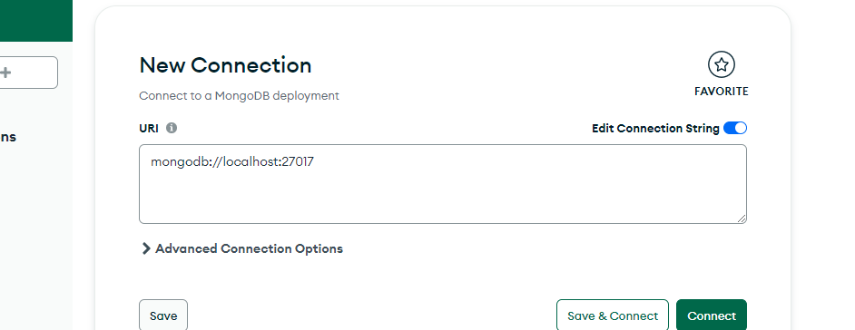

# download mongodb database
https://www.mongodb.com/try/download/community-kubernetes-operator

# after install mongo db open  mongodb application and connect

# copy connection url and paste in app.py this area
"app.config["MONGO_URI"] = "{YOUR CONNECTION URL}}/fitnessapp""

# create new database in mongodb as "fitnessapp"
# create new table in  "fitnessapp" mongodb as "users"

# open projecr folder using vs code
# open terminal in vs code
# create virtual environment  using following commnad
python -m venv myenv
# activate virtual environment 
myenv/Scripts/activate

# install dependencies
pip install -r requirements.txt

# run application
flask --app app.py --debug run

#################################
# UPDATED FILES(COPY AND PASTE)
#################################

copy all file that i send your in the zip and paste in your project folder
give "replace the file in the desination" option.
open terminal and activate virtual environment
	myenv/Scripts/activate
run this command
	pip install -r requirements.txt

##############################
# GOOGLE APP API CREATION
##############################

# go to this link
https://myaccount.google.com/security

# Click "2 Step Verification" 
# give your credential to login
# click "App passwords"
# Select app >> Others
# Geneate
# Copy that API String
# Paste That at "password" variable in app.py(I send photo)
# add your email to the "sender_email" variable in app.py(I send photo)

